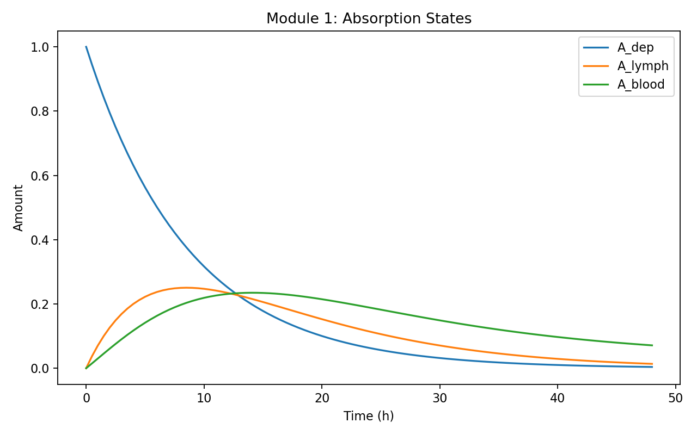
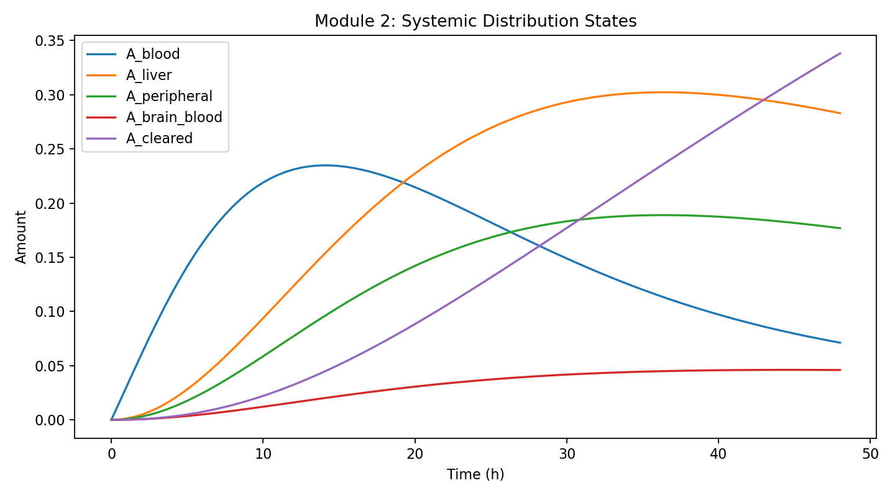
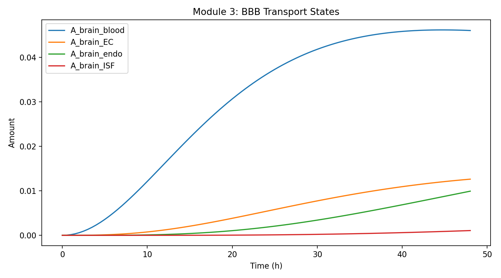
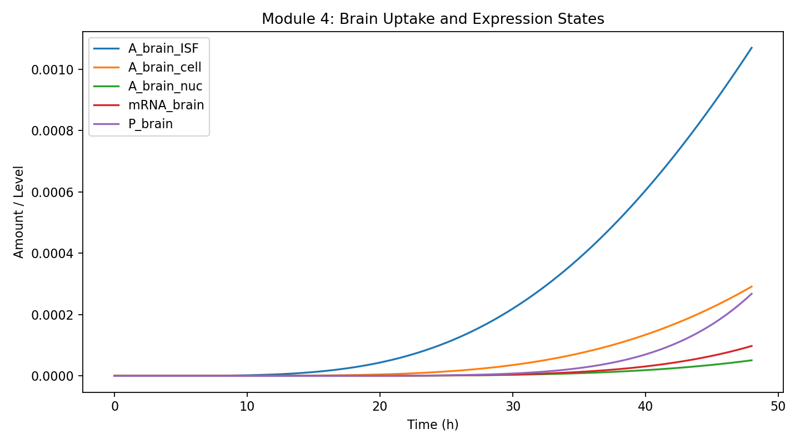

# Biological Process Simulated by the Model

The full model contains five biological modules plus a decision layer. The
first four modules simulate delivery and editor expression. Module 5 is the
core RNA editing model.

## Module 1: Absorption

Biological meaning: after local administration, the delivery vehicle can remain
near the injection site, enter lymphatic drainage, enter blood, or degrade.

Model output:



How to read the figure: it shows where the input dose goes during the early
delivery phase. This module matters mainly for translational delivery modeling.
For a pure HEK293T transfection experiment, this module can later be replaced by
a direct plasmid/transfection input.

## Module 2: Systemic Distribution

Biological meaning: material in blood can distribute to liver, peripheral
tissues, and the brain vascular compartment.

Model output:



Why it matters: systemic delivery often has strong liver exposure. Modeling
this helps us avoid presenting brain editing alone without considering
delivery-related burden.

## Module 3: BBB Transport

Biological meaning: delivery material near the brain vascular side must cross
or interact with the blood-brain barrier before reaching brain interstitial
space.

Model output:



Why it matters: this module is an optional translational extension. It lets us
discuss what would change if the project moves from cell culture to in vivo
delivery.

## Module 4: Intracellular Expression

Biological meaning: after entering the cell and nucleus, the construct is
transcribed into editor mRNA and translated into active PUF-APOBEC protein.

Model output:



Why it matters: poor editing can be caused by weak expression rather than weak
RNA targeting. This module tells wet lab whether to measure editor mRNA,
editor protein, or editing efficiency next.

## Module 5: APOE Multisite RNA Editing

Biological meaning: active PUF-APOBEC protein binds APOE RNA and edits C-to-U
at codon 112 and/or codon 158. The model also separates three off-target
mechanisms.

Model output:


Key states:

- `S_APOE4`: unedited APOE4-like RNA.
- `S_APOE3_like`: codon 112 edited; desired APOE3-like product.
- `S_APOE2_like`: codons 112 and 158 edited; tracked as APOE2-like risk.
- `B_local_bystander`: nearby C edits after correct target binding.
- `E_puf_off`: PUF-mediated mismatch off-target editing.
- `E_deaminase_bg`: deaminase-only background editing.

The editing reaction follows:

```text
Editor + RNA <-> Editor-RNA complex -> Editor + edited RNA
```

## Decision Layer

The final layer converts simulation outputs into design recommendations. It
compares candidate PUF-deaminase designs, expression levels, and sampling times,
then ranks them using a utility score and Pareto-style tradeoff.

This is the layer that makes the model useful for wet lab: it turns simulation
into "what should we test next?"
