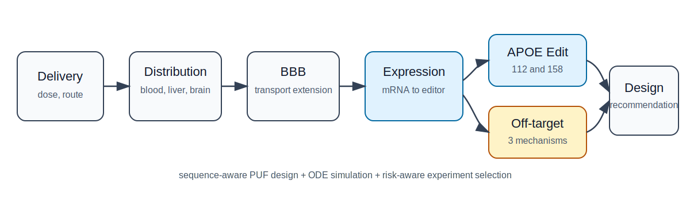
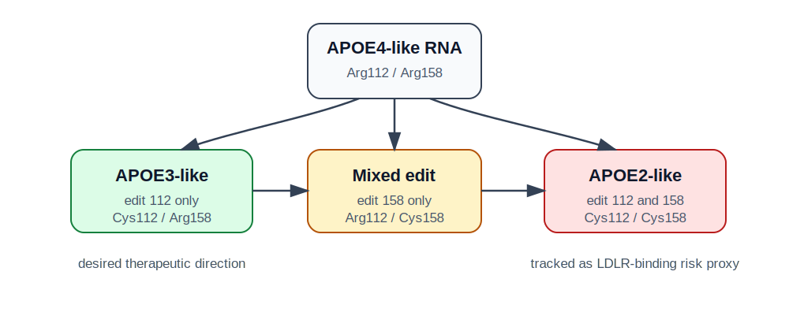
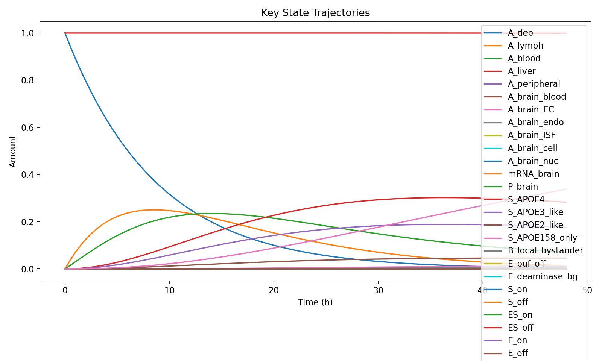
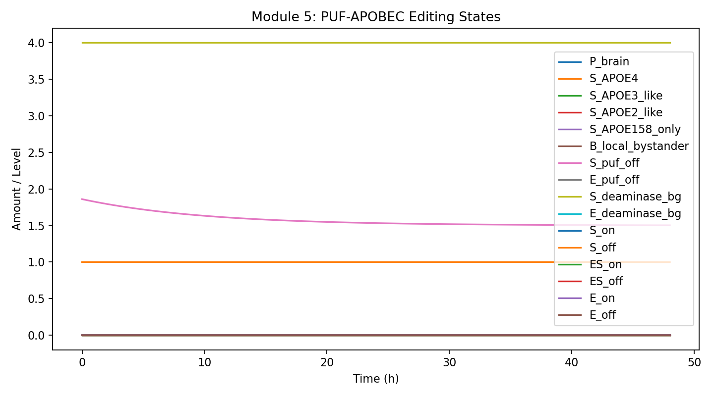
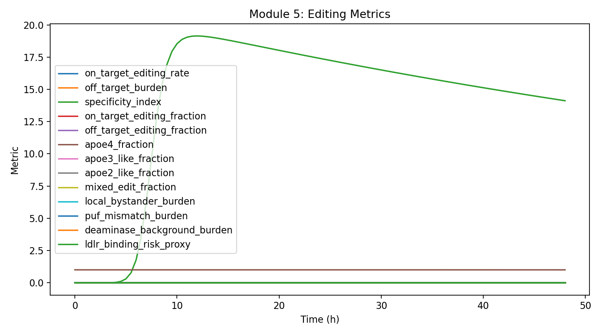
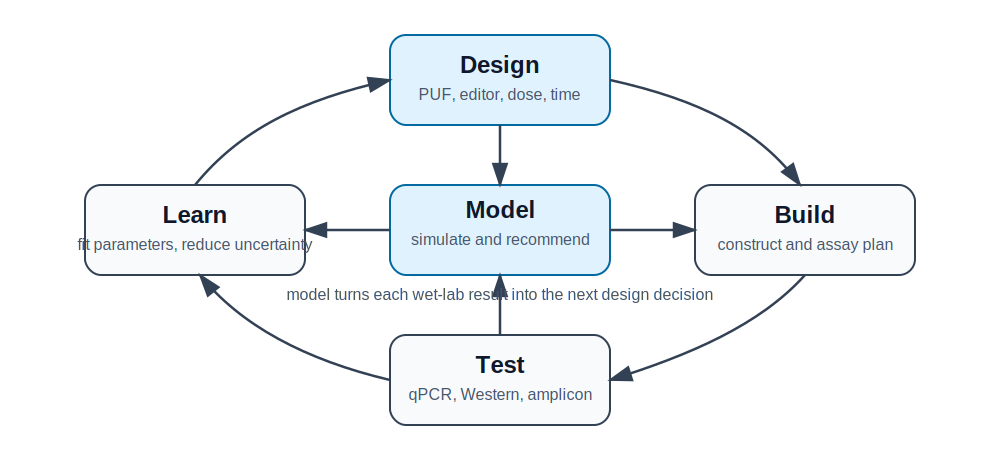

# Modeling

## A Sequence-Aware Digital Twin for APOE RNA Editing

We developed a sequence-aware, literature-grounded digital twin that connects
PUF-APOBEC design to editor expression, APOE112/APOE158 RNA editing,
off-target risk, and model-guided experimental selection.



## Why Modeling Was Needed

Our wet-lab system contains many design choices:

- which PUF target sequence to use;
- whether to use A3A or an engineered deaminase;
- how much editor to express;
- when to sample;
- how to balance APOE3-like benefit against APOE2-like and off-target risk.

Testing every combination experimentally would be inefficient. Our model turns
these choices into a quantitative design problem. It predicts which design is
most promising, what risk it carries, and which experiment should be done next
to improve the model.

## Biological Logic: APOE112 and APOE158 Must Be Modeled Separately

APOE isoforms are determined by two positions:

| Isoform-like state | Codon 112 | Codon 158 | Meaning in our model |
|---|---|---|---|
| APOE4-like | Arg | Arg | starting state |
| APOE3-like | Cys | Arg | desired APOE4-to-APOE3-like direction |
| APOE2-like | Cys | Cys | double-edited state tracked as risk |
| Mixed edit | Arg | Cys | incomplete or non-target product |



This is a key improvement over a simple on-target/off-target model. It prevents
us from incorrectly treating all edited APOE RNA as the same product.

## What Biological Processes Are Simulated

The full model contains five mechanistic modules.

| Module | Biological process | Why it matters |
|---|---|---|
| Module 1 | absorption from local dose | shows how much material enters the system |
| Module 2 | blood, liver, peripheral, brain distribution | tracks delivery burden and brain exposure |
| Module 3 | BBB transport | optional translational extension for CNS delivery |
| Module 4 | intracellular expression | connects delivered construct to active editor protein |
| Module 5 | APOE multisite RNA editing | predicts APOE3-like benefit and off-target risk |



## Core Editing Model

The editing reaction is modeled as explicit binding, unbinding, and catalysis:

```text
Editor + APOE RNA <-> Editor-RNA complex -> Editor + edited RNA
```

For each candidate PUF design, sequence features are converted into kinetic
parameters:

```text
k_on scale = exp(beta1 * PUF_score + beta2 * accessibility)
k_cat scale = (0.04 + 0.96 * UC_context) * exp(-0.9 * abs(distance - 2))
PUF off-target scale = exp(-1.4 * max(PUF_repeats - 8, 0)) * exp(0.45 * mismatch_count)
```

This lets the model compare real design features rather than only arbitrary
parameter sets.



## Off-Target Risk Is Split into Three Mechanisms

| Off-target class | What it means | How wet lab can test it |
|---|---|---|
| Local bystander | correct target binding, nearby C edited | APOE amplicon sequencing |
| PUF mismatch | PUF binds a similar off-target RNA | predicted off-target panel / RNA-seq |
| Deaminase background | APOBEC edits without correct PUF targeting | mock, PUF-only, inactive A3A, free-A3A controls |



This makes the model actionable. Different off-target mechanisms require
different engineering fixes.

## Literature-Grounded Parameters

The model uses literature-derived priors, not final constants. The most
important reference is the CU-REWIRE paper by Han et al. (2022), which supports:

- PUF-APOBEC3A architecture;
- 48 h HEK293T readout;
- preferred editing window near PUF +2;
- UC context preference;
- 10R PUF specificity;
- deaminase-only background editing.

Other references support PUF engineering, APOE isoform biology, mRNA/protein
turnover, AAV distribution, and model identifiability.

Detailed parameter source tables are in:

```text
docs/WIKI_PARAMETER_AND_REFERENCE_SOURCES_CN.md
more_paper/literature_research_for_model_v4_CN.md
```

## Main Simulation Result

The current v4 design screen compares PUF-deaminase candidate, expression
level, and sampling time. With current literature-informed priors, the top
candidate is:

| Output | Current result |
|---|---|
| Design | `10R-proapobec` |
| Editor | `ProAPOBEC` |
| Expression level | `high` |
| Sampling time | `72 h` |
| Expected APOE3-like fraction | about `0.0666` |
| APOE2-like risk proxy | about `3.6e-06` |
| Off-target burden | about `0.00373` |

The 72 h recommendation should be interpreted carefully: the current model
still includes delivery and expression delay. For a pure HEK293T transfection
model, 48 h remains the key CU-REWIRE reference time.

The full design table is stored in:

```text
docs_wiki/result_tables/v4_design_recommendation_for_wiki.md
```

## What Makes the Model Rigorous

1. It encodes APOE biology correctly by separating codon 112 and codon 158.
2. It separates off-target mechanisms instead of reporting one vague number.
3. It documents parameter sources and uncertainty.
4. It includes wet-lab bridge files for qPCR, Western blot, and amplicon-seq.
5. It produces design recommendations, not only retrospective plots.
6. It leaves a clear route for future parameter fitting and identifiability
   analysis.



## Next Wet-Lab Data Needed

| Data | Why needed |
|---|---|
| APOE112/APOE158 editing at 24/48/72 h | fit target editing kinetics |
| linked APOE112/APOE158 amplicon | separate APOE3-like and APOE2-like products |
| local bystander C editing | calibrate local bystander burden |
| top-K off-target panel | calibrate PUF mismatch risk |
| mock / PUF-only / inactive A3A controls | separate background from true editing |
| editor mRNA qPCR and protein Western | distinguish expression limitation from editing limitation |

## Final Conclusion

The v4 model turns literature knowledge and early wet-lab plans into a
quantitative engineering loop. It gives the team a principled way to select
PUF-APOBEC designs, evaluate APOE editing outcomes, track off-target risks, and
decide which experiment should be done next.
